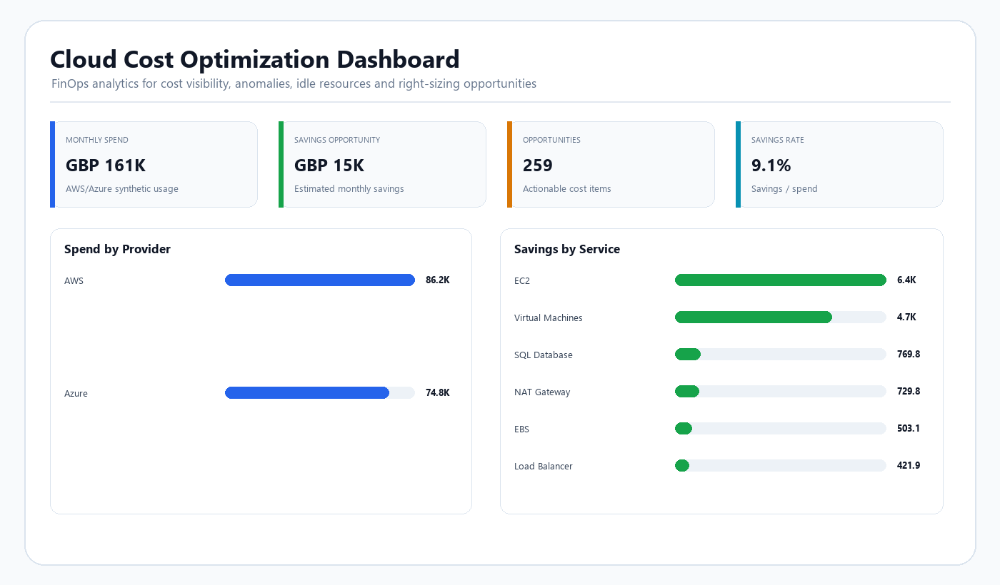

# Cloud Cost Optimization Analytics


## Demo Preview



## Business Problem

Cloud environments often become more expensive because of:

- Oversized compute
- Idle VMs
- Underused storage
- Poor lifecycle policies
- NAT / load-balancer cost outliers
- Missing commitment discounts
- Weak tagging
- Cost anomalies
- Limited ownership visibility

This project turns synthetic AWS/Azure cost and utilisation data into an optimisation backlog and executive dashboard.

## Tech Stack

- Python
- Pandas
- SQL
- Power BI-ready data
- DAX
- AWS / Azure cost concepts
- FinOps concepts

## Repository Structure

```text
cloud-cost-optimization-analytics/
├── data/
│   ├── raw/
│   └── processed/
├── src/
├── sql/
├── powerbi/
├── docs/
├── screenshots/
├── requirements.txt
└── README.md
```

## Core KPIs

- Total Cloud Cost
- Estimated Monthly Savings
- Potential Annual Savings
- Idle VM Candidates
- Cost Anomalies
- Tagging Non-Compliance
- Resources Requiring Action
- Cost by Provider
- Cost by Service
- Cost by Environment
- Savings by Owner Team

## Optimisation Logic

### Compute
Low CPU and memory utilisation can indicate a right-sizing candidate, but a production decision should also consider:
- latency
- peak demand
- memory
- availability requirements
- licensing
- business criticality
- seasonal load

### Storage
Low utilisation can indicate:
- unattached storage
- overprovisioned disks
- lifecycle/tiering opportunities

### Cost Anomalies
Unexpected spend should be investigated against:
- usage changes
- deployment events
- traffic spikes
- configuration changes
- pricing changes
- legitimate business demand

### Commitments
Stable production workloads may benefit from:
- AWS Savings Plans / Reserved Instances
- Azure Reservations / Savings Plans

The portfolio flags candidates but does not automatically assume commitment purchasing is always correct.

## Dashboard Pages

### 1. Executive Cloud Cost Overview
Cost, savings, anomalies, idle resources and provider/environment breakdown.

### 2. Right-Sizing & Utilisation
CPU/memory analysis, idle resources and owner-level savings.

### 3. Storage & Network Optimisation
Underused storage, lifecycle candidates and network-service cost outliers.

### 4. FinOps Governance
Tagging, ownership, cost anomalies and accountability.

## Production Data Sources

A real implementation could integrate:

- AWS Cost Explorer
- AWS Cost & Usage Report
- AWS CloudWatch
- AWS Compute Optimizer
- Azure Cost Management
- Azure Monitor
- Azure Advisor
- CMDB
- finance / budget data

Those integrations are potential production adaptations, not claims about this repository.

## Run the Analysis

```bash
pip install -r requirements.txt
python src/analysis.py
```

## Skills Demonstrated

- Cloud cost analytics
- AWS
- Azure
- FinOps
- Python
- SQL
- Power BI
- Data modelling
- Cost governance
- Right-sizing logic
- Cloud operations
- Executive reporting

## Interview Talking Points

1. Why CPU utilisation alone is not enough for right-sizing.
2. Savings Plans vs Reserved Instances.
3. Azure Reservations / Advisor concepts.
4. Idle resource detection.
5. Storage lifecycle optimisation.
6. NAT Gateway cost drivers.
7. Cost allocation tags.
8. Anomaly detection.
9. FinOps collaboration model.
10. Difference between estimated and realised savings.

## Portfolio Classification

**Type:** Portfolio Build  
**Data:** Synthetic  
**Purpose:** Demonstrate cloud cost optimisation, FinOps analytics, SQL/Python and BI reporting.
